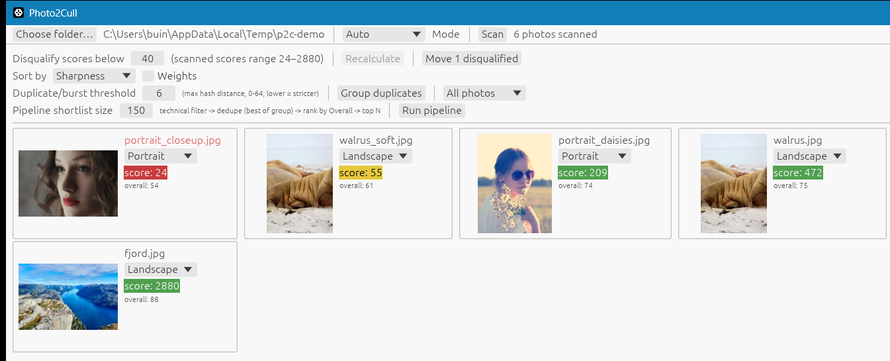

# Photo2Cull

A desktop app for quickly culling a folder of photos down to your keepers -- point it at a folder, it scores every photo, and you decide what survives.



## What it does

- **Scans a folder** of RAW (via `rawler`) or standard photos (PNG, JPG, TIFF, BMP, WebP) and scores each one for focus sharpness (variance-of-Laplacian).
- **Classifies each photo** as Landscape, Portrait, or Object, either automatically (ML face detection decides Portrait vs. a heuristic for the rest) or manually per photo, and rescoring adapts to the region that matters for that mode (e.g. the detected face for portraits).
- **Ranks photos with an Overall score** blending six factors -- sharpness, exposure, contrast, color, composition (rule-of-thirds), and subject prominence (for portraits) -- with adjustable weights that re-rank instantly.
- **Groups duplicates and bursts** using perceptual hashing, and flags the best-of-group pick by Overall score.
- **Runs a full pipeline**: technical sharpness cull -> dedupe -> rank by Overall -> top-N shortlist, in one click.
- **Moves disqualified photos** out of the way (into a `disqualified` subfolder) instead of deleting them, so culling stays reversible.

## Getting started

Download a build from the [Releases](https://github.com/peterbuitho/Photo2Cull/releases) page (Windows, macOS Apple Silicon, or Linux x86_64), or build from source:

```
cargo run --release
```

Pick a folder, click Scan, then sort/filter/group as needed.
